---
jupyter:
  colab:
    name: CW2.ipynb
  kernelspec:
    display_name: Python 3
    language: python
    name: python3
  language_info:
    codemirror_mode:
      name: ipython
      version: 3
    file_extension: .py
    mimetype: text/x-python
    name: python
    nbconvert_exporter: python
    pygments_lexer: ipython3
    version: 3.8.5
  nbformat: 4
  nbformat_minor: 1
---

# CNN for Cardiac MR Image Segmentation

# Preview
This is a group project for building a CNN with PyTorch. The task is to create a model that given an input image of a Cardiac MRI scans, it will ouput the semantic sementation of the image into different anatomical zones. One of the unique challenges of the data we had was the distribution of classes, in particular the fact that the "background region" class 0 was prevalent in every image. This could easily provide CNNs with the trap of "learning" to classify everything as 0 and it would provide good accuracy by default.

The data set consisted of:
-   Training: 100 images
-   Validation: 20 images
-   Test: 80 images

Here's a preview of some sample results:


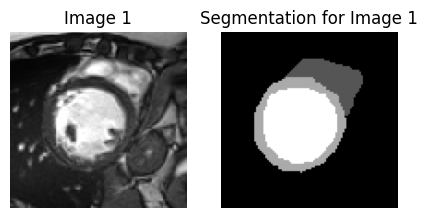
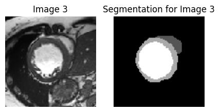
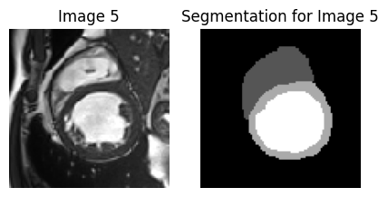
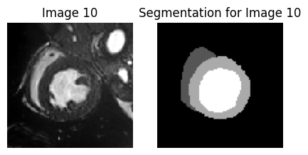
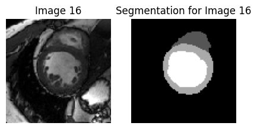

# Introduction

We were tasked with generating a semantic segmentation of CMR images
using deep learning, in particular multiple CNN architectures. The data
we had consisted of the following:

-   Training: 100 images & ground truths
-   Validation: 20 images & ground truths
-   Test: 80 images

The task was a supervised ML task, as we had both the input data and
their correct label, and we were training the CNN to correctly classify
each pixel into a region based on that data. One of the unique
challenges of the data we had was the distribution of classes, in
particular the fact that the "background region" class 0 was prevalent
in every image. This could easily provide CNNs with the trap of
"learning" to classify everything as 0 and it would provide good
accuracy by default. Our aim was to find a good CNN architecture that
provides an accurate classification of each pixel of the heart images
into the 4 region classes in an efficient, stable and consistent manner.

## Our chosen architecture: U-Net

U-Net (Ronneberger, Fischer and Brox, 2015) is a fast and precise
architecture. Its name is due to the U-like shape it has when
visualised. The left part of the "U" if the contract path. This consists
of the repeated application of two or more 3x3 convolutions, each
followed by ReLU, batch normalisation and a 2x2 max pooling operation
with stride 2 for downsampling. At each downsampling step, we double the
number of feature channels. The expansive path consists of an upsampling
of the feature map followed by a 2x2 convolution that halves the number
of feature channels, a concatenation with the corresponding cropped
feature map from the contracting path, and two or more 3x3 convolutions,
each followed by ReLU and batch normalisation. This architecture is
effective, firstly because downsampling allows the more general and less
detailed features to be extracted. Additionally, in the expansive path,
the concatenation with feature maps from the contract path means that
the more detailed features are not lost after downsampling. As a result,
U-Net is able to extract both more general and more specific features
from an image. In our tests, this architecture was optimal in terms of
training time and accuracy. For this reason, it was selected as our
preferred architecture for the rest of the experiments.


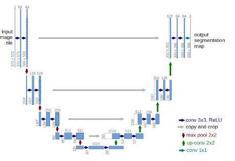

Diagram of the U-Net architecture. - (Ronneberger, Fischer and Brox,
2015)


## Other Architectures Attempted

### A different biological segmenter

One of the network architectures that we tested was the one described in
the paper \"Toward Automatic Phenotyping of Developing Embryos from
Videos\" (Feng Ning et al., 2005). This paper describes a neural network
that was used for segmenting biological images of cells. This seemed
like it might be an appropriate architecture to use as it was also
specifically applied to a similar problem with grayscale biological
images. The network was fairly straightforward to implement with
PyTorch, and after being trained for 1000 epochs it was getting
near-zero loss (as measured by the cross entropy for each output label)
on the training set. However, the two problems were subpar
generalisation to the test set (never doing better than an average Dice
score of about 0.73) and outputting masks of lower resolution than the
input image. The network has two subsampling layers that both reduce the
horizontal and vertical resolution by 50%, so the final mask is 1/4 the
size of the image in both directions. The lack of pixel-level accuracy
is probably a reason why the Dice scores were poor, while the
cross-entropy (which was only calculated once for each output pixel by
requiring it to have the most common label among the 16 corresponding
input pixels) was quite good. We can conclude that this is probably a
good network structure, but only for an application that does not
require pixel-level accuracy.

### AlexNet

Krizhevsky, Sutskever and Hinton (2017) introduce AlexNet for
classification of images; while the main purpose of the architecture is
for classification, we believed the success for classification would
translate to semantic segmentation. With a rough implementation, the
model initially produced static masks. However, by changing the
optimiser from the original stochastic gradient descent to Adam we saw
that the model would learn at a steady rate. After 100 epochs it would
produce the mask with high accuracy on the training data. We tested the
model on a validation dataset which the model has not seen before using
the dice score as a metric of accuracy. Unfortunately, the dice score
average was 0.45 this signifies the model has heavily overfitted the
training data. An attempt to solve this issue was to change the number
of epochs and increase the dropout rate. However, this seems to not have
solved the problem so we will not be pursuing this model.

### SegNet

We've looked at SegNet (Badrinarayanan, Kendall and Cipolla, 2015) as
another option. SegNet uses an encoder-decoder architecture, based on
that of VGG16, using the same topology for the 13 convolutional layers
(Simonyan and Zisserman, 2015). What differentiates SegNet from other
architectures is that it is maintaining the indices from the max-pooling
layers, and using them in the unpooling layers where maximal values are
placed according to their max-pooling index and non-maximal values are
set to 0. It was mostly developed for scene understanding applications.
We trained it using Adam for 200 epochs and it achieved a pretty good
Dice score of about 0.82 on training data and 0.80 on both validation
data and Kaggle, meaning it wasn't heavily overfitted to the training
data. However, we found that SegNet is meant to use all of the
pre-trained convolutional layer weights from VGG net as pre-trained
weights (Badrinarayanan, Kendall and Cipolla, 2015). Since U-Net was
proposed specifically for the medical community, it has fewer layers to
manage (no conv5 block by default), doesn't require pre-trained weights
from VGG16 (Ronneberger, Fischer and Brox, 2015), as well as providing
better overall results for our tests, we decided against choosing SegNet
as our final architecture.

# Implementation

## 1. Load, show, and save images with OpenCV

The code below was provided

``` python
from matplotlib import pyplot as plt
def show_image_mask(img, mask, cmap='gray'): # visualisation
    fig = plt.figure(figsize=(5,5))
    plt.subplot(1, 2, 1)
    plt.imshow(img, cmap=cmap)
    plt.axis('off')
    plt.subplot(1, 2, 2)
    plt.imshow(mask, cmap=cmap)
    plt.axis('off')
```

``` python
import os
import cv2 #import OpenCV

data_dir = './data/test'
image = cv2.imread(os.path.join(data_dir,'image','cmr170.png'), cv2.IMREAD_UNCHANGED)
mask = cv2.imread(os.path.join(data_dir,'mask','cmr170_mask.png'), cv2.IMREAD_UNCHANGED)
show_image_mask(image, mask, cmap='gray')
plt.pause(1)
#cv2.imwrite(os.path.join('./','cmr121.png'), mask*85)
```
## 2 Define a segmentation model with Pytorch 

### 2.1 Define a DataLoader 

Dataloaders were provided.

``` python
import torch
import torch.utils.data as data
import cv2
import os
from glob import glob

class TrainDataset(data.Dataset):
    def __init__(self, root=''):
        super(TrainDataset, self).__init__()
        self.img_files = glob(os.path.join(root,'image','*.png'))
        self.mask_files = []
        for img_path in self.img_files:
            basename = os.path.basename(img_path)
            self.mask_files.append(os.path.join(root,'mask',basename[:-4]+'_mask.png'))
            

    def __getitem__(self, index):
            img_path = self.img_files[index]
            mask_path = self.mask_files[index]
            data = cv2.imread(img_path, cv2.IMREAD_UNCHANGED)
            label = cv2.imread(mask_path, cv2.IMREAD_UNCHANGED)
            return torch.from_numpy(data).float(), torch.from_numpy(label).float()

    def __len__(self):
        return len(self.img_files)

class TestDataset(data.Dataset):
    def __init__(self, root=''):
        super(TestDataset, self).__init__()
        self.img_files = glob(os.path.join(root,'image','*.png'))

    def __getitem__(self, index):
            img_path = self.img_files[index]
            data = cv2.imread(img_path, cv2.IMREAD_UNCHANGED)
            return torch.from_numpy(data).float()

    def __len__(self):
        return len(self.img_files)
```

### 2.2 Define a Segmentation Model 

Below is our CNN model for semantic segmentation

``` python
import torch
import torch.nn as nn
import torch.nn.functional as F
```

``` python
'''This model has been created by building upon the code found at:
https://medium.com/analytics-vidhya/creating-a-very-simple-u-net-model-with-pytorch-for-semantic-segmentation-of-satellite-images-223aa216e705
(Cordeiro, 2020)
'''
from torch import nn
class UNET(nn.Module):
    def __init__(self, in_channels, out_channels):
        super().__init__()
        # defining the layers of the U-Net
        
        # contract segment
        self.conv1 = self.contract_block(in_channels, 32, 7, 3)
        self.conv2 = self.contract_block(32, 64, 3, 1)
        self.conv3 = self.contract_block(64, 128, 3, 1)
        self.conv4 = self.contract_block(128, 256, 3, 1)
        self.conv5 = self.contract_block(256, 512, 3, 1)
        
        # expand segment
        self.upconv5 = self.expand_block(512, 256, 3, 1)
        self.upconv4 = self.expand_block(256*2, 128, 3, 1)
        self.upconv3 = self.expand_block(128*2, 64, 3, 1)
        self.upconv2 = self.expand_block(64*2, 32, 3, 1)
        self.upconv1 = self.expand_block(32*2, out_channels, 3, 1)

    def __call__(self, x):

        # downsampling part
        conv1 = self.conv1(x)
        conv2 = self.conv2(conv1)
        conv3 = self.conv3(conv2)
        conv4 = self.conv4(conv3)
        conv5 = self.conv5(conv4)
        
        # upsampling part
        upconv5 = self.upconv5(conv5)
        upconv4 = self.upconv4(torch.cat([upconv5, conv4], 1))
        upconv3 = self.upconv3(torch.cat([upconv4, conv3], 1))
        upconv2 = self.upconv2(torch.cat([upconv3, conv2], 1))
        upconv1 = self.upconv1(torch.cat([upconv2, conv1], 1))
        
        return F.softmax(upconv1, dim = 1)
    
    # A contract block is a sequential application of convolution, ReLU, and batch normalisation, and finally maxpooling
    def contract_block(self, in_channels, out_channels, kernel_size, padding):

        contract = nn.Sequential(
            torch.nn.Conv2d(in_channels, out_channels, kernel_size=kernel_size, stride=1, padding=padding),
            torch.nn.BatchNorm2d(out_channels),
            torch.nn.ReLU(),
            torch.nn.Conv2d(out_channels, out_channels, kernel_size=kernel_size, stride=1, padding=padding),
            torch.nn.BatchNorm2d(out_channels),
            torch.nn.ReLU(),
            torch.nn.Conv2d(out_channels, out_channels, kernel_size=kernel_size, stride=1, padding=padding),
            torch.nn.BatchNorm2d(out_channels),
            torch.nn.ReLU(),
            torch.nn.MaxPool2d(kernel_size=3, stride=2, padding=1)
                                 )

        return contract

    # An expand block is a sequential application of convolution, ReLU, and batch normalisation
    # A transposed 2D convolution is then applied to upsample the feature map by a factor of 2.
    def expand_block(self, in_channels, out_channels, kernel_size, padding):

        expand = nn.Sequential(torch.nn.Conv2d(in_channels, out_channels, kernel_size, stride=1, padding=padding),
                            torch.nn.BatchNorm2d(out_channels),
                            torch.nn.ReLU(),
                            torch.nn.Conv2d(out_channels, out_channels, kernel_size, stride=1, padding=padding),
                            torch.nn.BatchNorm2d(out_channels),
                            torch.nn.ReLU(),
                            torch.nn.Conv2d(out_channels, out_channels, kernel_size, stride=1, padding=padding),
                            torch.nn.BatchNorm2d(out_channels),
                            torch.nn.ReLU(),
                            torch.nn.ConvTranspose2d(out_channels, out_channels, kernel_size=3, stride=2, padding=1, output_padding=1) 
                            )
        return expand
```
### 2.3 Define a Loss function and optimizer

``` python
from torch.autograd import Variable

def split_masks(masks, num_classes):
    '''This function takes a mask in the format of a 2d tensor of size (h,w) with values 0 -> num_classes. 
    It then oututs an 3d tensor of size (num_classes,h,w), which contains a 2d array for each classes from 0 -> num_classes.
    Each element contains a 1 if it is that classes and a 0 if it is not that class.
    
    For example:
    
    [[1,2,1]              [[[0,0,0]  [[1,0,1]  [[0,1,0]
     [0,1,1]       =>       [1,0,0]   [0,1,1]   [0,0,0]  
     [0,2,0]]               [1,0,1]]  [0,0,0]]  [0,1,0]]]                                                       '''
    
    height,width = masks.shape[1], masks.shape[2]
    batch_size = masks.shape[0]
    
    indices = torch.arange(0, num_classes).repeat_interleave(height * width).view((num_classes, height, width))
    indices = torch.cat(2 * [indices])
    
    masks_repeated = masks.repeat_interleave(num_classes, dim = 0)

    split_masks = (masks_repeated == indices).type(torch.DoubleTensor).view((batch_size, num_classes, height, width))
    
    return split_masks 

def cross_entropy_loss(y, predict, avoid_zero_const = 0.001):
    '''This is a custom loss function for cross entropy loss. 
    It takes 2 probability distributions (y and predict) and outputs the average cross entropy between them.
    
    avoid_zero_const is for avoiding calling log(0), which would cause an error.
    
    The custom loss function is used because when programming this we were unaware of the in built cross entropy 
    loss function. However, by implementing it ourselves we were able to understand cross_entropy_loss in 
    more detail, which gave us a better appreciation for what it is doing and why it works well.
    
    To calculate entropy we used this formula:
    
    
    cross_entropy_loss = -(ylog(p) + (1-y)log(1-p))
    
    Cross entropy is effective, because not only does it penalise incorrect classifications, but it also 
    penalises uncertainty. For example, if one model had 0.6 certainty of the correct classification, but 
    a second one had 0.9 certainty, the second one would achieve a better cross_entropy score and hence a 
    lower cross_entropy_loss (due to the negation).
    '''
    
    y = y.flatten()
    predict= predict.flatten() 
    log_predict = torch.log(predict + avoid_zero_const)
    
    log_1_minus_predict = torch.log(1 - (predict - avoid_zero_const))
    
    cross_entropies = (y * log_predict) + ( (1 - y) * log_1_minus_predict ) 
    
    return -1 * (1/cross_entropies.shape[0]) * (cross_entropies.sum())

    
import torch.optim as optim
model = UNET(1,4)
optimizer = optim.Adam(model.parameters(), lr = 0.001)
```
### 2.4 Training

``` python
def categorical_dice(mask1, mask2, label_class=1):
    """
    Dice score of a specified class between two volumes of label masks.
    (classes are encoded but by label class number not one-hot )
    Note: stacks of 2D slices are consideredvolumes.

    Args:
        mask1: N label masks, numpy array shaped (H, W, N)
        mask2: N label masks, numpy array shaped (H, W, N)
        label_class: the class over which to calculate dice scores

    Returns:
        volume_dice
    """
    mask1_pos = (mask1 == label_class).astype(np.float32)
    mask2_pos = (mask2 == label_class).astype(np.float32)
    dice = 2 * np.sum(mask1_pos * mask2_pos) / (np.sum(mask1_pos) + np.sum(mask2_pos))
    return dice

def load_model(path, blank_model):
    '''Loads the weights into a blank model from a .pt file.
    The architecture of the blank model and the .pt file must match.'''
    blank_model.load_state_dict(torch.load(path))
    blank_model.eval()
    return blank_model


def evaluate_model(model_path, blank_model, show = True): 
    '''Gets the average dice score for the model on the validation set.
    If show = True it will display all the masks generated with their
    dice scores'''
    
    if model_path != "":
        eval_model = load_model(model_path, blank_model)
    else:
        eval_model = blank_model
    
    data_path = './data/val'
    num_workers = 4
    batch_size = 1

    val_set = TrainDataset(data_path)
    val_data_loader = DataLoader(dataset=val_set, num_workers=num_workers,batch_size=batch_size, shuffle=True)

    n = 0
    total_dice = 0

    for iteration, sample in enumerate(val_data_loader):
        img, mask = sample

        img = img.view(batch_size, 1, img.shape[1], img.shape[2])

        out = eval_model(img)
        out = out.argmax(dim = 1)

        for i in range(batch_size):
            dice_score = 0
            for l in range(1, 4):
                dice_score += categorical_dice(mask[0].numpy(), out[0].numpy(), label_class = l)
            dice_score = dice_score/3
            if(show):
                show_image_mask(mask[0,...].squeeze(), out[0,...].squeeze()) 
                print(dice_score)
            
            total_dice += dice_score
            n += 1

        plt.pause(1)
    
    return total_dice / n
    
    
```

``` python
from torch.utils.data import DataLoader
import numpy as np

data_path = './data/train'
num_workers = 4
batch_size = 2
train_set = TrainDataset(data_path)
training_data_loader = DataLoader(dataset=train_set, num_workers=num_workers, batch_size=batch_size, shuffle=True)

epoch = 140

losses = []
dice_scores = []
model.train()
for e in range(epoch):
    # Fetch images and labels.  
    for iteration, sample in enumerate(training_data_loader):
        img, mask = sample
        model.zero_grad()
        img = img.view(img.shape[0], 1, img.shape[1], img.shape[2])
        out = model(img)
        loss = cross_entropy_loss(split_masks(mask, 4), out)
        loss.backward()
        optimizer.step()    
        
    out_mask = out.argmax(dim = 1)
    
    print("Epoch: {0}   Loss: {1}".format(e, loss.item()))
    
    # Evaluate every 10 epochs
    if(e % 10 == 0):
        model.eval()
        dice = evaluate_model("", model, show = False)
        losses.append(loss.item())
        dice_scores.append(dice)
        print("Dice: {0}".format(dice))
        model.train()
    
    
    
```
``` python
#SAVES THE MODEL TO A FILE
PATH = "UNET.pt"
torch.save(model.state_dict(), PATH)


#PLOT THE LOSS AND DICE SCORE
import matplotlib.pyplot as plt

x = np.arange(0,epoch,10)


plt.plot(x, dice_scores, label = "Dice Score")
plt.plot(x, losses, label = "Loss")

plt.title('Dice Score and Loss Against Epochs')
plt.xlabel('Epochs')
plt.legend()
plt.show()


```
### 2.5 Testing 

``` python
import numpy as np
from torch.autograd import Variable
```

``` python
# Load saved model and deploy it to all data in test set to produce segmentation masks in png images 
# valued 0,1,2,3, which will be used for the submission to Kaggle

def load_model(path, blank_model):
    blank_model.load_state_dict(torch.load(path))
    blank_model.eval()
    return blank_model

data_path = './data/test'
num_workers = 4
batch_size = 1

model = load_model(PATH, UNET(1,4))

test_set = TestDataset(data_path)
test_data_loader = DataLoader(dataset=test_set, num_workers=num_workers,batch_size=batch_size, shuffle=False)

# works on windows. on linux the images may not be taken in order
img_num = 121
for iteration, sample in enumerate(test_data_loader):
    img_name = "./data/test/mask/cmr{0}_mask.png".format(img_num)
    img_num += 1
    img = sample
    img = img.view(1, 1, img.shape[1], img.shape[2])
    out = model(img)
    out = out.argmax(dim = 1)[0]

    cv2.imwrite(img_name, out.numpy())
```

## 3 Evaluation

### 3.1 Dice Score

Dice method defined above.

``` python
evaluate_model(PATH, UNET(1,4))
```

### 3.2 Submission 

``` python
import numpy as np
import os
import cv2

def rle_encoding(x):
    '''
    *** Credit to https://www.kaggle.com/rakhlin/fast-run-length-encoding-python ***
    x: numpy array of shape (height, width), 1 - mask, 0 - background
    Returns run length as list
    '''
    dots = np.where(x.T.flatten() == 1)[0]
    run_lengths = []
    prev = -2
    for b in dots:
        if (b > prev + 1): run_lengths.extend((b + 1, 0))
        run_lengths[-1] += 1
        prev = b
    return run_lengths


def submission_converter(mask_directory, path_to_save):
    writer = open(os.path.join(path_to_save, "submission.csv"), 'w')
    writer.write('id,encoding\n')

    files = os.listdir(mask_directory)

    for file in files:
        name = file[:-4]
        mask = cv2.imread(os.path.join(mask_directory, file), cv2.IMREAD_UNCHANGED)

        mask1 = (mask == 1)
        mask2 = (mask == 2)
        mask3 = (mask == 3)

        encoded_mask1 = rle_encoding(mask1)
        encoded_mask1 = ' '.join(str(e) for e in encoded_mask1)
        encoded_mask2 = rle_encoding(mask2)
        encoded_mask2 = ' '.join(str(e) for e in encoded_mask2)
        encoded_mask3 = rle_encoding(mask3)
        encoded_mask3 = ' '.join(str(e) for e in encoded_mask3)

        writer.write(name + '1,' + encoded_mask1 + "\n")
        writer.write(name + '2,' + encoded_mask2 + "\n")
        writer.write(name + '3,' + encoded_mask3 + "\n")

    writer.close()
    
    
submission_converter("./data/test/mask","")
```
# Experiments

## Learning Rate

We did an experiment with adjusting the learning rate to see if that had
an impact on the final performance. The performance was measured by
calculating the average Dice score on the validation set after a given
number of epochs. The first experiment used a wide variety of possible
learning rates ranging from 0.001 to 1 in order to detect viable ranges
for the learning rate to inform future experiments. As this was testing
a large number of different learning rates and was not intended to be
the final experiment, each run was only trained for 200 epochs to save
time.

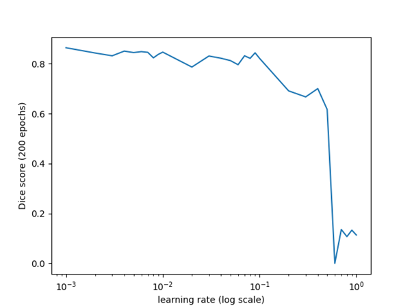

As you can see from the above graph (which uses a log scale on the
x-axis), it was clear that there was very little value in going above
about 0.01. The 0 from 0.6 was probably an error, but as all the values
in that region were terrible anyway then it didn\'t seem worth rerunning
the experiment.

The second experiment focused only on very small values compared to the
previous test. As the difference between the low values seemed within
random variation, and as higher epoch numbers normally benefit low
learning rates more than high learning rates, we only focused on
learning rates below 0.025 for this test. The advantages of being able
to run multiple tests per value and run tests for 300 epochs rather than
just 200 seemed like enough of a benefit to offset the disadvantage of a
narrower range of tested values.

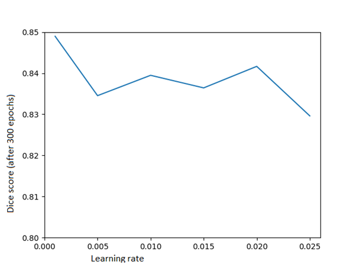

As you can see from the above graph, the difference was still fairly
minimal, although as each value was tested seven times to get the above
values (rather than just one or two as in the previous graph), it may be
the case that the small differences are actually reflective of a real
performance difference. As 0.001 was still the best performing learning
rate, the next step was to investigate values smaller than that. We
hadn\'t done that with the previous experiments because 0.001 seemed
like so tiny a value (in comparison to the learning rates that had
worked well for the previous \"fashion categorisation\" network) that
the best value must be higher. As the results proved this wrong, an
exploration of smaller values made sense.

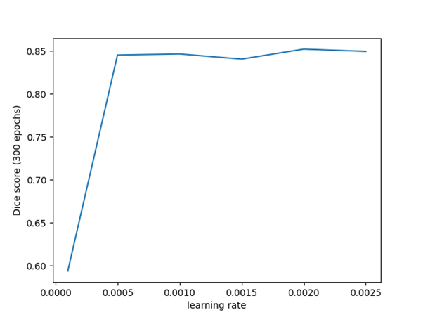

The difference is again fairly minimal aside from the extremely low
value (0.0001), which performs poorly due to presumably not being
trained for enough epochs for the values to change enough. We can
therefore conclude that any value of around 0.001 is appropriate for the
learning rate.

## Batch size

We looked at multiple batch sizes that would work with the amount of
training data we had: 2, 4, 8, 16 and 32. Whilst training for 250
epochs, we looked at the loss on the training set and the Dice score on
the validation set every 5 epochs and put them in a plot. As for other
hyperparameters, we kept the learning rate 0.001, we used Adam and ReLU.
For the batch sizes that are not divisors of 100, the last batch was
automatically created of smaller size. For this experiment, we discarded
that smaller last batch for 2 reasons: 1. The data is shuffled so images
discarded in one epoch will be used in another one eventually; 2. We
wanted to keep the experiment "pure" by only using batches of the
specified size. Here are the results:

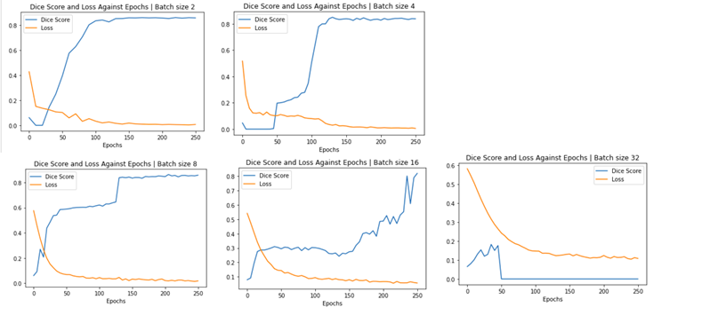

From our experiments, we concluded that the bigger the batch size, the
later the Dice score will reach its peak value. With a big batch size,
we also saw that the Dice score wasn't increasing steadily, but rather
in unpredictable bursts. While the Dice was behaving rather poorly with
bigger batch sizes, the loss was behaving quite predictably, always
reducing in an exponential curve. However, the minimum value of the loss
was getting bigger with the batch size, meaning the smaller batch size
also provided the smallest value for the loss.

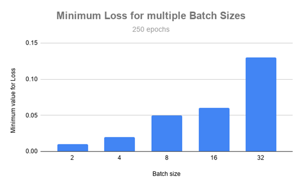

We think the bigger batch sizes are performing worse because of the
amount of data we have. Using batch size 32 means there are only 3 full
batches per epoch and that might not be enough for training to be
effective. Following these experiments, we moved forward with a batch
size of 2 for our architecture.

## Activation Functions

The activation functions we experimented on were Sigmoid, LeakyReLU,
ReLU, Tanh and HardTanh. We trained the model on the different
activation functions while keeping the rest of the hyperparameters
constant. With the trained model we produced a metric of accuracy by
inputting the validation data through the model and calculating the
average dice score.

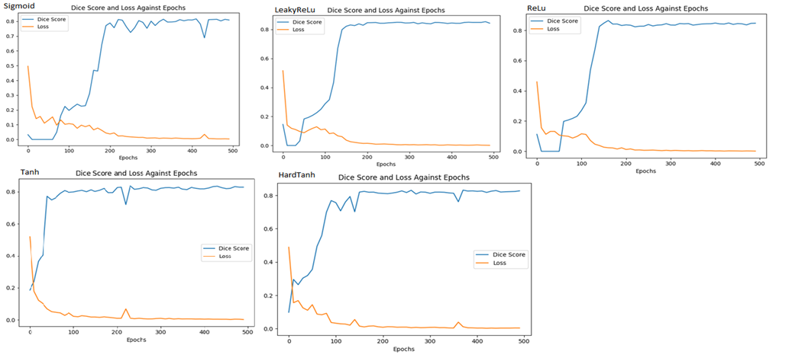

The results above show the loss and dice score against epoch for the
different activation functions on the training data. All activation
functions end up with approximately 0.8 dice score. Nothing is
separating them, apart from the rate they can reach their maximum dice
score or minimum loss. TanH and HardTanH produces a higher initial dice
score compared to the others and learns initially very fast while the
other functions start with very low dice scores. The dice scores can be
as low as 0 and stay low until approximately 70 epochs before we see an
increase in dice score. Comparing all the functions ReLu and leaky ReLu
seems to be the most stable when reaching their maximum dice score, with
the graph showing less oscillation at max dice score.

Below you can see the results of each activation function. We can see
that ReLU and Leaky ReLU have the highest average dice scores of 0.844
and 0.847 respectively. HardTanh seems to have overfitted the training
data as the graph shows a dice score of above 0.8 and on the validation,
we see the dice score of 0.78. We can eliminate HardTanh as the
activation function we will use for our final model. The evidence shows
Leaky ReLu's dice score is 0.003 better than ReLU's dice score, however,
we believe this to be noise and through reinforcement of the other
researched architecture, ReLu seems to be the most optimal activation
function. The difference is small enough that a different validation set
may cause ReLU to have a better score. We can also see from the previous
graphs that ReLu is stable. Therefore ReLu will be used as our final
activation function for our model.

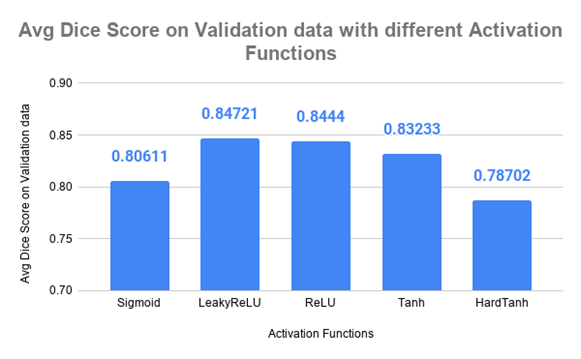

### Number of in-channels and out-channels

We have also run a few tests on the number of in-channels and
out-channels of the convolutional layers in the contract and expand
blocks. We wanted to see if the particular size of our training images
could benefit from smaller or larger values for these channels. We
trained the network with LR 0.001, using Adam, ReLU and Batch size 2 for
250 epochs, recording the dice score on the validation set every 10
epochs, for multiple configurations. Here are the results:

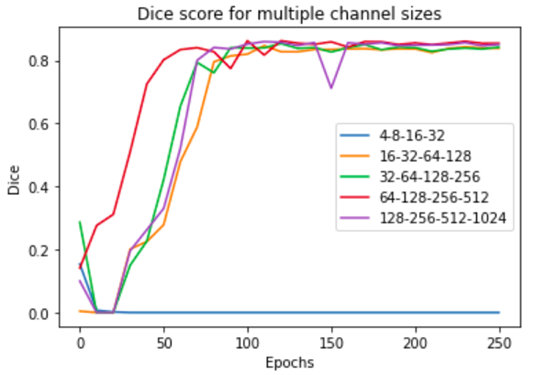

From the graph, it is evident that small values for the channels fail in
making the network learn anything. The bigger values all end up making
the network learn in about the same time and achieve similar dice
scores. However, the one configuration that stood out as learning the
fastest and also achieving the best maximum dice score (albeit by a
small margin of 0.02) was 64-128-256-512. We used these values in the
final network.

## Network Topology

For network topology, we looked at two variables: The number of blocks
in the model, and the number of "block depth" or 2D convolution layers
per block:

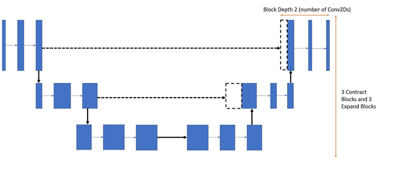

To begin with we recorded the classification average accuracy of
different topologies on the validation data set. We tried block depths
of 2-4 and numbers of blocks from 2-5, and each experiment was run for
250 epochs on the provided training data with a batch size of 2 and a
learning rate of 0.001. Below are the results:

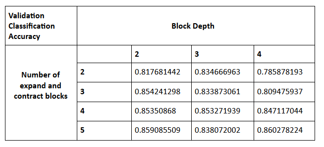

The main conclusion that can be drawn from these results is that the
classification accuracy improves with the number of contract and expand
blocks. It is not possible to have more than 5 blocks without changing
the factor with which the blocks are downsampled (in this case 2), so a
future experiment might be to change this factor and add more blocks to
see if the accuracy can be improved. For now, though we will conclude
that 5 is the optimal number of blocks. The results do not show any
obvious correlation between classification accuracy and block depth. To
test this we ran some further experiments on some higher blocks depths,
to see if a trend could be discovered:

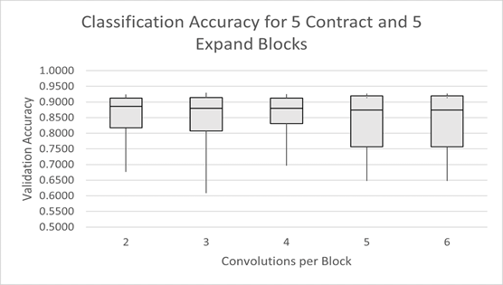

The results obtained indicated that there was no strong relationship
between the block depth and validation accuracy; any difference in the
box plots is most likely dependent on the initial weights and not the
number of conv2d layers per block. Therefore it is better to use a lower
depth in order to reduce training time, such as 2. In conclusion, to
optimise training time and performance we should use a block depth of 2
and have 5 contract blocks and 5 expand blocks.

### Kernel size

We tested the effects of kernel size on the performance of U-Net. We
tested all of the models using padding, with padding equal to (kernel
size-1) /2. Removing the use of the kernel (moving to a 1\*1 kernel)
made the model need more epochs to reach its final performance.
Increasing the size of the kernel does not have a very noticeable effect
on the performance of the model and increases the training time further.
Because of this, we decided to keep the 3\*3 kernel

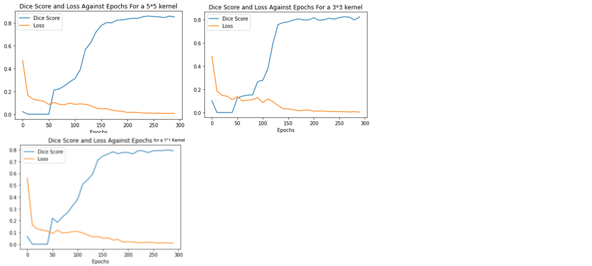

### Optimisers

The optimiser aims to minimise the cost function by finding the
optimised value for weights. We tested Stochastic Gradient Descent
(SGD), Adaptive Moment Estimation (Adam) which combines Adagrad and
RMSprop, and AdamW which implements Adam except the weight decay is
performed only after controlling the step size, which can improve
efficiency. We tested the dice score and loss for these three
optimisers, over 200 epochs to save time.

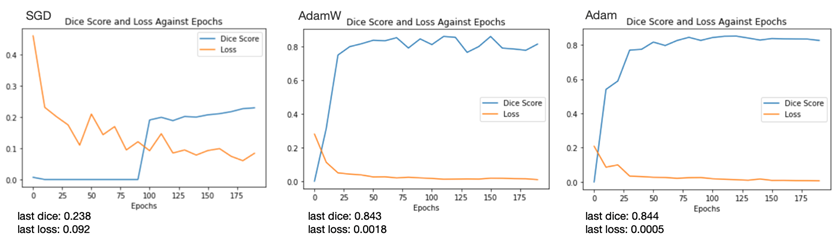

We observed that SGD was clearly sub-optimal, however, AdamW and Adam
gave closer results. The loss for AdamW was superior to that of Adam, so
we chose to use Adam as our preferred optimiser.

## Regularisation experiments

### Dropout

Generalisation performance of a neural network can sometimes be improved
by randomly removing some neurons during the processing of each training
example. We ran a test of this, measuring performance on the validation
set after 300 epochs for different dropout rates (dropping neurons in
the convolutional layers) up to 0.5.

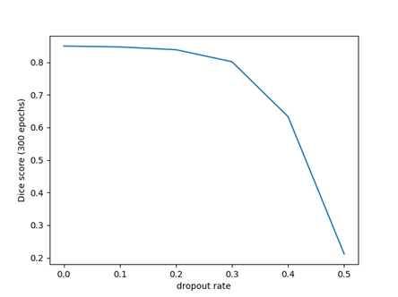

As the graph shows, there was no improvement in performance and
performance does in fact get significantly worse with dropout rates
above 0.2. As dropout layers seem expensive for PyTorch to run (as the
network was taking much longer to run with them than it had been
previously), possibly due to the need to generate lots of pseudorandom
numbers, we decided not to investigate this any further. The final
network does not use dropout.

### Augmented dataset

We also looked at how the dice score behaves when trained on the dataset
augmented with mirrored versions of the images. We trained the network
with the same hyperparameters with both the normal and augmented
training sets and plotted the dice score on the validation set. Here are
the results:

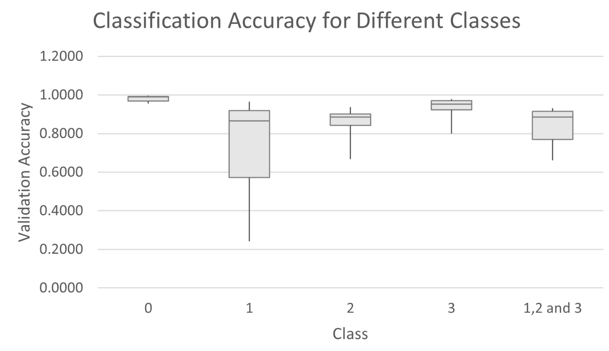

We observed that there was no significant increase in accuracy after 150
epochs. We chose to pick our preferred number of epochs using the early
stopping method, to minimise overfitting, where a gap appears between
the accuracy of the model on the training data and the testing data. The
gap starts to form after 136 epochs, and accounting for some noise we
chose 140 epochs as our final number of epochs.

### Early stopping

We were first concerned that, with the added mirrored data, the duration
of an epoch would increase. After testing, we concluded there was
virtually no difference. When choosing how many epochs to train the
model for, the tradeoff is between an increased accuracy and added
computation cost.

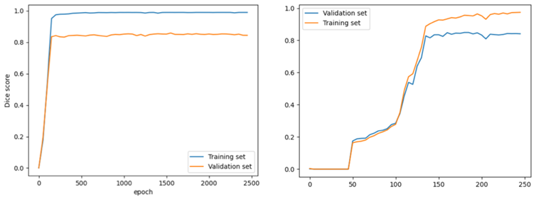

We observed that there was no significant increase in accuracy after 150
epochs. We chose to pick our preferred number of epochs using the early
stopping method, to minimise overfitting, where a gap appears between
the accuracy of the model on the training data and the testing data. The
gap starts to form after 136 epochs, and accounting for some noise we
chose 140 epochs as our final number of epochs.

# Conclusion: Final architecture, performance and statistical analysis

Final hyperparameters for our architecture:

-   Learning rate: 0.001

-   Batch size: 2

-   Kernel size: 3

-   Channel sizes: 32-64-128-256-512

-   Epochs: 140

-   Blocks: 5 blocks in each stage (contract, expand)

-   Block depth: 2

-   Activation function: ReLU

-   Optimiser: Adam

### Best generalisation performance

Best Dice score on validation data: 0.86027

Best Kaggle score: 0.87568

### Individual class statistics

 This
graph shows that classes 0, 2 and 3 were being reliably classified, but
our architecture seems to struggle with correctly classifying class 1.
This might be because that segment occupies different locations in the
images, compared to the white region which is almost always right in the
centre. It is also similar in colour to the background so it may be hard
for the classifier to discern between the two.

### Standard deviations per class

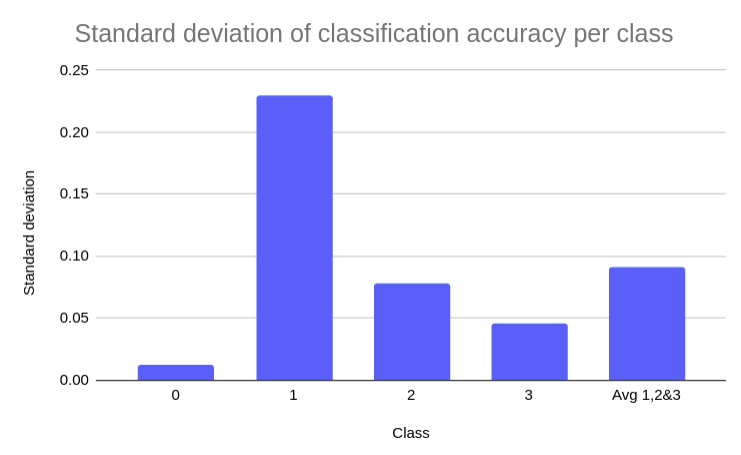

This again confirms that the most accurately classified class is 3
(white region) with the least amount of variation, and the most
deviation occurred in class 1.

# References

Badrinarayanan, V., Kendall, A. and Cipolla, R. (2015). SegNet: A Deep
Convolutional Encoder-Decoder Architecture for Image Segmentation.
\[online\] Available at: <https://arxiv.org/pdf/1511.00561.pdf>
\[Accessed 8 Dec. 2020\].

Feng Ning, Delhomme, D., LeCun, Y., Piano, F., Bottou, L. and Barbano,
P.E. (2005). Toward automatic phenotyping of developing embryos from
videos. IEEE Transactions on Image Processing, 14(9), pp.1360--1371.

Krizhevsky, A., Sutskever, I., & Hinton, G. E. (2017). Imagenet
classification with deep convolutional neural networks. Communications
of the ACM, 60(6), 84-90.

Ronneberger, O, Fischer, P and Brox, T. (2015). U-Net: Convolutional
Networks for Biomedical Image Segmentation. Medical Image Computing and
Computer-Assisted Intervention (MICCAI), \[online\] Available at:
<https://arxiv.org/pdf/1505.04597.pdf> \[Accessed 15 Dec. 2020\]

Simonyan, K. and Zisserman, A. (2015). VERY DEEP CONVOLUTIONAL NETWORKS
FOR LARGE-SCALE IMAGE RECOGNITION. \[online\] Available at:
<https://arxiv.org/pdf/1409.1556.pdf> \[Accessed 8 Dec. 2020\].

Cordeiro, M. (2020). Creating a Very Simple U-Net Model with PyTorch for
Semantic Segmentation of Satellite Images. \[online\] Available at:
<https://medium.com/analytics-vidhya/creating-a-very-simple-u-net-model-with-pytorch-for-semantic-segmentation-of-satellite-images-223aa216e705>
\[Accessed 18 Dec. 2020\]

